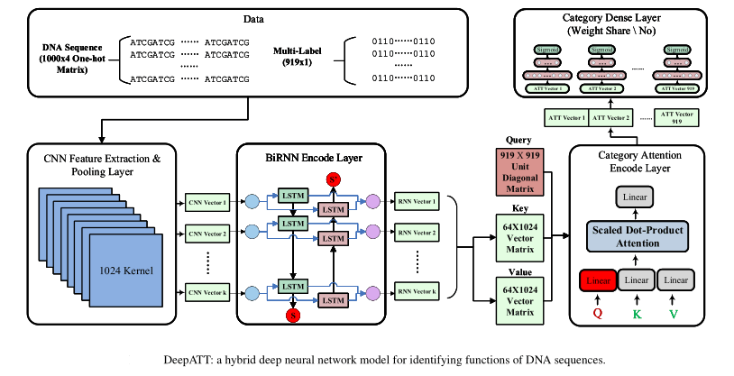
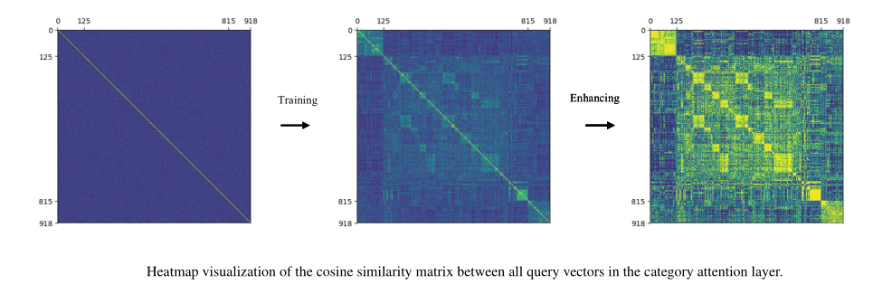

# Bioinfor DeepATT

DeepATT is a model for identifying functional effects of DNA sequences. This is implemented by tensorflow-2.0.
Our model has four built-in neural network constructions: convolution layer captures regulatory motifs,
recurrent layer captures a regulatory grammar, category attention layer (improved from self-attention layer) selects
corresponding valid features for different functions, and category dense layer (improved from local-connected dense
layer) classifies the labels with feature vectors selected by the query vectors of the regulatory functions. We compare
DeepATT with DeepSEA and DanQ, which are all implemented or replicated on our own platform. Comparison results
demonstrate that DeepATT achieves state-of-the-art performance of **0.94519** AV-AUROC and **0.39522** AV-AUPR,
which is far better than other non-coding DNA regulatory function prediction methods. **The performances of all the
models that were described in the original paper are shown in the below Table.**

Model|DeepSEA|DanQ|DanQ_JASPAR|DeepATT|DeepATT_Plus|
:-:|:-:|:-:|:-:|:-:|:-:|
AV-AUPR|0.34163|0.37089|0.37936|0.39522|0.39324
AV-AUROC|0.93260|0.93837|0.94174|0.94519|0.94432
Parameter number|61,723,119|46,926,479|67,892,175|7,808,057|7,900,775

**Key Points:**
- We propose a hybrid deep neural network method with four built-in
neural network layers, DeepATT, for identifying 919 regulatory
functions on nearly 5 million DNA sequences. We firstly design a
category attention layer and category dense layer in order to distinguish
specific representations of different DNA functions.
- We replicate two state-of-the-art models, DeepSEA and DanQ,
in order to compare different model architectures with our novel
model construction. DeepATT performs significantly better than other
prediction tools for identifying DNA functions.
- Our novel model mine important correlation among different DNA
functions according to the category attention module. The attention
mechanism calculates scores of feature vectors to estimate all
functional targets for different DNA regulatory functions.
- Our novel model reduce the number of hyper-parameters by attention
mechanism and local full-connected, on the basis of ensuring
prediction accuracy. The attention mechanism determines relevant
characteristics for each binary target, and the local connection
eliminates all unnecessary features for specific connections

## Citation

```
@article{Li2020DeepATT,
  title={DeepATT: a hybrid category attention neural network for identifying functional effects of DNA sequences},
  author={Li, Jiawei and Pu, Yuqian and Tang, Jijun and Zou, Quan and Guo, Fei},
  journal={Briefings in Bioinformatics},
  year={2020},
}
```

Our laboratory web site:
[http://lbci.tju.edu.cn/](<http://lbci.tju.edu.cn/>)


## DeepATT


### Model Architecture
- **DeepSEA**

    CNN + Pool + CNN + Pool + CNN + Pool + Dense + Dense
- **DanQ**

    CNN(320 kernels) + Pool + BidLSTM + Dense + Dense
- **DanQ_JASPAR**

    CNN(1024 kernels) + Pool + BidLSTM + Dense + Dense
- **DeepATT**

    CNN + Pool + BidLSTM + Category Multi-Head-Attention + Category-Dense(relu)(weight-share) + Category-Dense(sigmoid)(weight-share)
- **DeepATT-Plus**

    CNN + Pool + BidLSTM + Category Multi-Head-Attention + Category-Dense(relu)(weight-share) + Category-Dense(sigmoid)(no weight-share)

### Loss Function
There we use NLLLoss or FocalLoss.
(You can change the config file to use these loss functions.)

### Optimization Method
We have implemented four optimization methods that include SGD, Adadelta, Adagrad, Adam and RMSprop.
(You can change the config file to use these methods.)

## USAGE

We run the code on Ubuntu 18.04 LTS with a GTX 1080ti GPU. It takes **1 or 2 hours** to train one model for one epoch.
And it takes **1 or 2 days** to get one trained model. And we have trained 28 models to do comparision.

### Requirement
[Python](<https://www.python.org>) (3.7.3) | [Tensorflow](<https://tensorflow.google.cn/install>) (2.0.0)
| [CUDA](<https://developer.nvidia.com/cuda-toolkit-archive>) (10.0) | [cuDNN](<https://developer.nvidia.com/cudnn>) (7.6.0)

### Data
You need to first download the training, validation, and testing sets from DeepSEA. You can download the datasets from
[here](<http://deepsea.princeton.edu/media/code/deepsea_train_bundle.v0.9.tar.gz>). After you have extracted the
contents of the tar.gz file, move the 3 .mat files into the **`./data/`** folder.

### Model File
You can download the config_7 and config_15 models in **`ftp://www.lbci.cn/model.zip`**

### Preprocess
Because of my RAM limited, I firstly transform the train.mat file to .tfrecord files.
```
python process/preprocess.py
```

### Train
Then you can train the model initially.
```
CUDA_VISIBLE_DEVICES=0 python main.py -e train -c ./config/config_0.json
```

### Test
When you have trained successfully, you can evaluate the model.
```
CUDA_VISIBLE_DEVICES=0 python main.py -e test -c ./config/config_0.json
```

## RESULT
You can get my [result](./result/DeepATT.xlsx) in the **`./result/`** directory.

### Performance
We use two metrics to evaluate the model. (AUROC, AUPR)

Model|Optimizer|Loss|Learning Rate|Scheduler|Batch Size|AVG AUPR|AVG AUROC|
:-:|:-:|:-:|:-:|:-:|:-:|:-:|:-:|
DeepSEA*|Adam|NLL|0.001|None|64|0.26140|0.89225
DeepSEA*|Adam|NLL|0.0005|None|64|0.29214|0.90847
DeepSEA*|Adam|Focal|0.001|None|64|0.24434|0.87009
DeepSEA*|Adam|Focal|0.0005|None|64|0.25994|0.88411
DanQ*|Adam|NLL|0.001|None|64|0.33254|0.92363
DanQ*|Adam|NLL|0.0005|None|64|0.35921|0.93399
DanQ*|Adam|Focal|0.001|None|64|0.34454|0.92875
DanQ*|Adam|Focal|0.0005|None|64|0.34962|0.93160
DanQ_JASPAR*|Adam|NLL|0.001|None|64|0.37443|0.93827
DanQ_JASPAR*|Adam|NLL|0.0005|None|64|0.37872|0.94001
DanQ_JASPAR*|Adam|Focal|0.001|None|64|0.37692|0.93954
DanQ_JASPAR*|Adam|Focal|0.0005|None|64|0.38441|0.94171
DeepATT|Adam|NLL|0.001|StepLR|64|0.39304|0.94422
DeepATT|Adam|NLL|0.001|None|64|0.38519|0.94232
DeepATT|Adam|NLL|0.0005|StepLR|64|0.39619|0.94486
DeepATT|Adam|NLL|0.0005|None|64|0.39267|0.94436
DeepATT|Adam|Focal|0.001|StepLR|64|0.39246|0.94432
DeepATT|Adam|Focal|0.001|None|64|0.39303|0.94332
DeepATT|Adam|Focal|0.0005|StepLR|64|**`0.39522`**|**`0.94519`**
DeepATT|Adam|Focal|0.0005|None|64|0.39488|0.94491
DeepATT_Plus|Adam|NLL|0.001|StepLR|64|0.38595|0.94271
DeepATT_Plus|Adam|NLL|0.001|None|64|0.37768|0.93932
DeepATT_Plus|Adam|NLL|0.0005|StepLR|64|0.38125|0.94196
DeepATT_Plus|Adam|NLL|0.0005|None|64|0.38406|0.94293
DeepATT_Plus|Adam|Focal|0.001|StepLR|64|0.38772|0.94266
DeepATT_Plus|Adam|Focal|0.001|None|64|0.38711|0.94274
DeepATT_Plus|Adam|Focal|0.0005|StepLR|64|**`0.39324`**|**`0.94432`**
DeepATT_Plus|Adam|Focal|0.0005|None|64|0.38797|0.94308

### Attention Analysis
We analyze all trained query vectors in the category attention layer, in order to mine the correlation among **919**
DNA non-coding regulatory functions. In the category attention module, we generate a **919 x 919** diagonal matrix
as input to the attention layer. First, we randomly generate **919** independent query vectors within **100**-length.
We calculate the cosine similarity matrix of these randomly query vectors, however, we obtain no valid correlation
information. Then, we effectively train query vectors in the category attention layer and calculate the cosine
similarity matrix for **919** chromatin features (**125** DNase features, **690** TF features, **104** Histone features).
Basically, we can find out some subtle correlations among the same function category. Moreover, we enhance the cosine
similarity matrix by the sigmoid function. Some obvious small blocks indicate a lot of learned correlation information
between **919** DNA non-coding regulatory functions. It need to be stated that three major categories of various
non-coding functions are quantified as DNase I sensitivity for **0-124** items, Transcription factor (TF) binding for
**125-814** items and Histone-mark profile for **815-918** items. It's worth noting that the cosine similarity matrix
reveals some sub-categories in the TF binding functions. We visualize the cosine similarity matrix by using heatmap,
as shown in below figure.



## ISSUE
If you encounter any issue or have a feedback, please don't hesitate to [raise an issue](<https://github.com/jiawei6636/Bioinfor-DeepATT/issues>).

## REFERENCE
> [Predicting effects of noncoding variants with deep learning-based sequence model](<https://www.nature.com/articles/nmeth.3547>) | [Github](<https://github.com/jisraeli/DeepSEA>)

> [DanQ: a hybrid convolutional and recurrent deep neural network for quantifying the function of DNA sequences](<https://www.ncbi.nlm.nih.gov/pmc/articles/PMC4914104/>) | [Github](<https://github.com/uci-cbcl/DanQ/>)